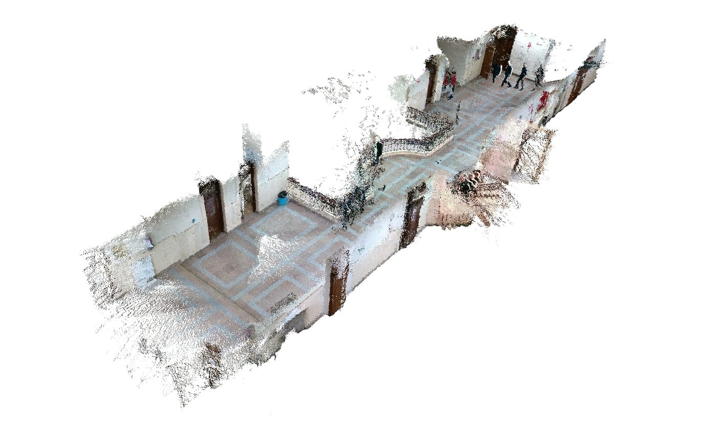

# RealSense RTAB-Map VIO 

This project showcases a complete implementation of visual-inertial SLAM using the Intel RealSense D455 and RTAB-Map within the ROS environment.

##  Overview

The project highlights practical integration through the following key capabilities:

- Real-time 3D mapping using RGB-D and IMU data
- Visual odometry with both **ORB and SIFT** feature detectors (compared side-by-side)
- **Loop closure detection** to correct trajectory drift
- **Pose graph optimization** for global consistency
- Generation of **dense point cloud maps**
- Visualizations of the **trajectory**, **graph structure**, and **loop closures**

---

## Project Setup

This project was implemented on a mobile robotic system for testing visual-inertial SLAM performance in real-world indoor settings.

### Hardware Setup

- **Intel RealSense D455**
  - RGB-D camera with onboard IMU
  - Used for both visual odometry and depth mapping
- **Clearpath Husky UGV**
  - Served as the mobile base to replicate realistic ground robot operation
- **Onboard Laptop**
  - Runs ROS Noetic and all mapping processes
  - Specs: NVIDIA GTX 1660 Ti (mobile), Intel Core i7-9750h, 16GB RAM

  

---

### Test Environment

- Mapping conducted in structured indoor spaces
- Included hallways and rooms with furniture and varying layout
- Designed to test loop closures, graph optimization, and keypoint robustness

<table align="center">
  <tr>
    <td align="center">
       
      <em>Structured Hallway</em>
    </td>
    <td align="center">
       
      <em>Lab Space with Dense Obstacles</em>
    </td>
  </tr>
</table>

## Core SLAM Processes

The SLAM system uses RTAB-Map to incrementally build 3D maps while tracking the robot's position over time. It combines visual odometry, loop closure, and graph optimization to maintain an accurate and drift-corrected trajectory. As the robot explores, the system detects previously visited locations and refines the map for global consistency.

##  Loop Closure Detection

Loop closures were automatically detected by comparing current visual data with previously seen scenes. When a match was found, RTAB-Map estimated the correction and updated the pose graph to align the trajectory. This helped reduce drift and improve map consistency during longer sessions.

<table align="center">
  <tr>
    <td align="center">
       
      <em>Loop Closure Detection</em>
    </td>
    <td align="center">
       
      <em>Feature Matching</em>
       
      <em>Camera odometry frame and 3D point cloud projection </em>
    </td>
  </tr>
</table>

In the example above, a loop closure was detected between Frame 135 and Frame 87, applying a correction of Δx = -0.0117 m and Δθ = -0.43° to the trajectory.

## Generated 3D Maps

Below are two examples of 3D point cloud maps generated using RTAB-Map with the Intel RealSense D455. These maps were built in real time while maintaining a drift-corrected trajectory through loop closure and graph optimization.

<table align="center">
  <tr>
    <td align="center">
       
      <em>Structured Hallway</em>
    </td>
    <td align="center">
       
      <em>Lab Space with Dense Obstacles</em>
    </td>
  </tr>
</table>

- **Lab Environment** – Captured in a confined indoor lab with dense obstacles such as tables and chairs. The map clearly shows the workspace layout, with a well-defined trajectory loop in the center.
- **Corridor Environment** – Captured along a long structured hallway with multiple turns. The map maintains wall alignment and straight trajectories despite extended travel distance.

These results highlight the system’s ability to adapt to both **dense, cluttered spaces** and **open, structured layouts**, producing consistent maps in varied indoor settings.

